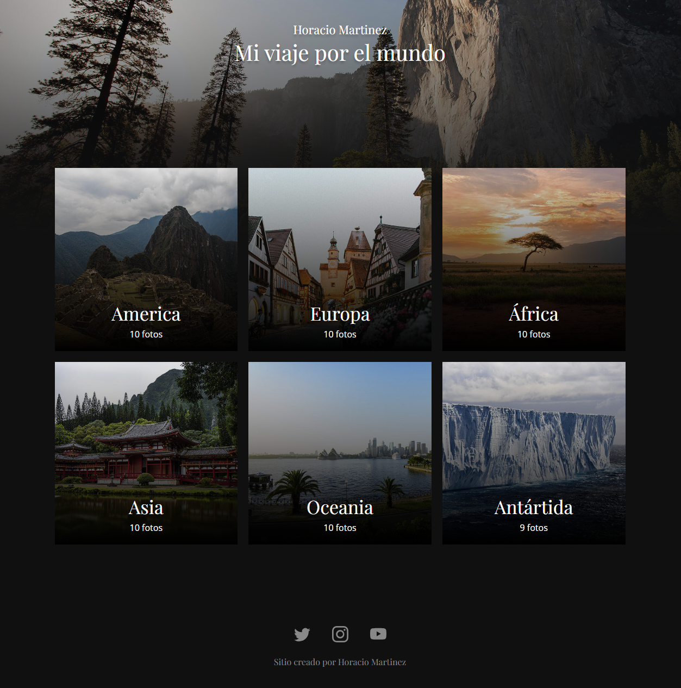

# Proyecto Galería de Imágenes Continentales

## Descripción del Proyecto

Bienvenido al proyecto de la Galería de Imágenes Continentales. Este proyecto tiene como objetivo ofrecer a los usuarios una experiencia visual única al explorar imágenes representativas de los seis continentes: África, América, Asia, Europa, Oceanía y Antártida.

## Características Principales

* **Vista de Continentes:**
  - Cada continente está representado por una tarjeta en la página principal.
  - Al hacer clic en una tarjeta, se redirige al usuario a una página dedicada al continente seleccionado.

* **Galería de Imágenes:**
  - En la página del continente, los usuarios encontrarán un carrusel de imágenes que representa la diversidad y belleza de la región.
  - Las imágenes están organizadas en un diseño de cuadrícula para una visualización eficiente.

* **Navegación Intuitiva:**
  - Se ha implementado un carrusel interactivo utilizando tecnologías como HTML, CSS, y JavaScript vanilla.
  - Los usuarios pueden navegar hacia adelante y hacia atrás utilizando botones ubicados en la imagen principal y en la barra inferior del carrusel.

* **Detalles de Imágenes:**
  - Cada imagen incluye un título y una descripción, proporcionando información adicional sobre su contexto y relevancia.

## Tecnologías Utilizadas

Este proyecto ha sido desarrollado utilizando una combinación de tecnologías web modernas:

* **HTML5:** Estructura semántica para una organización clara del contenido.
* **CSS3:** Estilos que proporcionan una interfaz atractiva y responsiva.
* **JavaScript Vanilla:** Implementación de la lógica del carrusel y la interactividad de la página.
* **Grid Layout:** Utilizado para organizar las imágenes de manera eficiente en la página del continente.

**Imagen de la home**

Esta imagen es una captura de pantalla de la página principal de la Galería de Imágenes Continentales. La página se ve bien en una pantalla de laptop. En el centro de la página hay una cuadrícula de imágenes de los seis continentes. Las imágenes son grandes y de alta calidad, y se pueden ver con claridad los detalles. Las imágenes están etiquetadas con el nombre de cada continente.

**Detalles:**

* La cuadrícula de imágenes se encuentra en el centro de la página.
* Las imágenes están organizadas en un diseño de cuadrícula de 3 x 2.
* Las imágenes están etiquetadas con el nombre de cada continente.




**Conclusión:**

La imagen de la página principal es una representación efectiva de la diversidad de los seis continentes. Es visualmente atractiva y fácil de navegar.


**Imagen de la página de descripciones**

Esta imagen es una captura de pantalla de la página de descripciones de la Galería de Imágenes Continentales. La página se ve bien en una pantalla de laptop. En el centro de la página hay un carrusel de imágenes de los seis continentes. Las imágenes son grandes y de alta calidad, y se pueden ver con claridad los detalles. Las imágenes están etiquetadas con el nombre de cada continente. Debajo del carrusel hay una descripción de cada imagen.

**Detalles:**

* El carrusel de imágenes se encuentra en el centro de la página.
* Las imágenes están organizadas en un diseño de carrusel.
* Las imágenes están etiquetadas con el nombre de cada continente.
* Debajo del carrusel hay una descripción de cada imagen.


**Conclusión:**

La imagen de la página de descripciones es una representación efectiva de la diversidad de los seis continentes. Es visualmente atractiva y proporciona información sobre cada imagen.

Para visitar la web, por favor sigue este enlace: [Galería de Imágenes Continentales]https://horaciomartinez17.github.io/galeria-imagenes/)


## Instrucciones de Ejecución

1. Clona este repositorio en tu máquina local.

```bash
git clone [https://github.com/tu-usuario/galeria-imagenes](https://github.com/tu-usuario/galeria-imagenes)


2. Abre el archivo `index.html` en tu navegador preferido.

3. Explora las tarjetas de los continentes y disfruta de la experiencia de la Galería de Imágenes.

